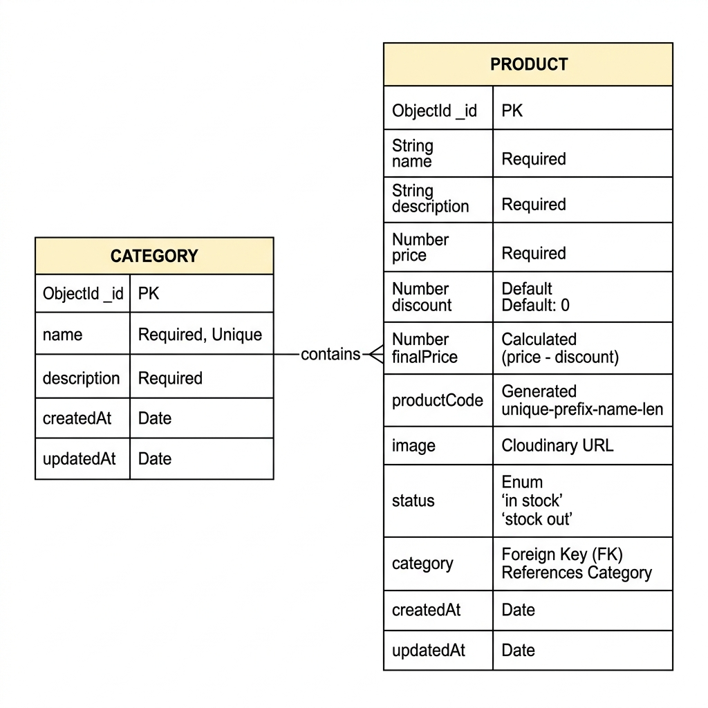
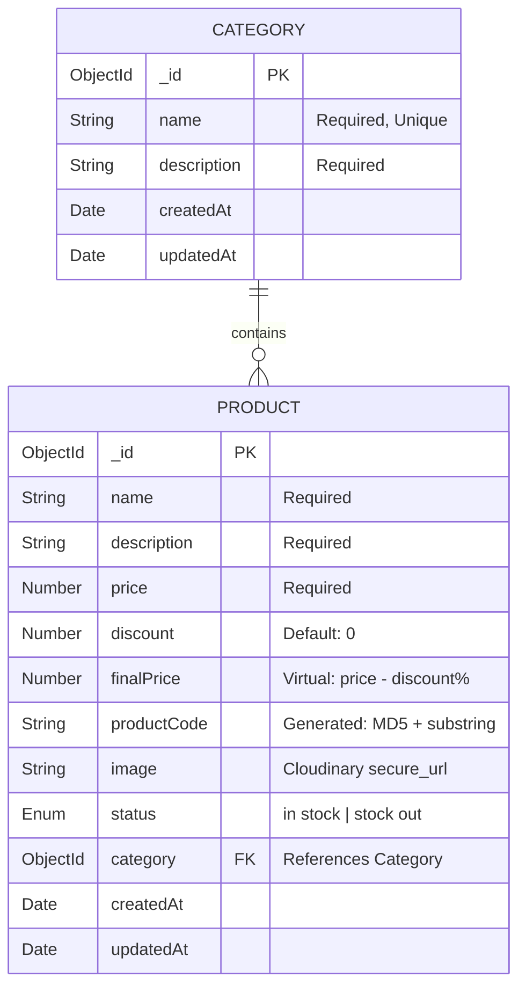

<p align="center">
  <h1 align="center">6SenseHQ — Backend Challenge</h1>
  <p align="center">
    A production-grade REST API for managing <strong>Products</strong> and <strong>Categories</strong>, built with TypeScript, Express 5, and MongoDB.
    <br />
    Featuring algorithmic product code generation, dynamic pricing, Cloudinary CDN integration, and comprehensive Swagger documentation.
  </p>
</p>

<p align="center">
  
  
  
  
  
  
</p>

---

## Table of Contents

- [Project Overview](#project-overview)
- [Tech Stack](#tech-stack)
- [Core Features & Business Logic](#core-features--business-logic)
- [Installation & Setup](#installation--setup)
- [API Documentation (Swagger)](#api-documentation-swagger)
- [API Endpoints](#api-endpoints)
- [Testing Strategy](#testing-strategy)
- [Database Design](#database-design)
- [Project Structure](#project-structure)
- [Error Handling](#error-handling)

---

## Project Overview

This project is a backend service built for the **6SenseHQ Backend Developer Challenge**. It implements a complete Product & Category management system with emphasis on:

- **Algorithmic uniqueness** — Every product receives a deterministic, collision-resistant code generated from its name using MD5 hashing and substring analysis.
- **Dynamic pricing** — Final prices are computed server-side as Mongoose virtuals, ensuring pricing logic never leaks to the client.
- **Cloud-native media** — Product images are uploaded directly to Cloudinary via `multipart/form-data`, and cleaned up from the CDN upon deletion.
- **Strict validation** — All request payloads pass through Zod schemas before reaching any business logic.

---

## Tech Stack

| Layer | Technology | Purpose |
|---|---|---|
| **Runtime** | Node.js + TypeScript 5.9 | Type-safe server-side JavaScript |
| **Framework** | Express 5 | HTTP routing, middleware pipeline |
| **Database** | MongoDB + Mongoose 9 | Document storage, schema validation, virtuals |
| **Validation** | Zod 4 | Request body/query/params schema validation |
| **File Upload** | Multer + Cloudinary | Multipart parsing → CDN upload pipeline |
| **Documentation** | Swagger (OpenAPI 3.0) | Auto-generated interactive API docs |
| **Security** | Helmet, HPP, CORS, Rate Limiting | Production-hardened HTTP security |
| **Observability** | Pino Logger, Prometheus Metrics | Structured logging, `/metrics` endpoint |
| **Testing** | Vitest + Supertest | Unit and integration test framework |

---

## Core Features & Business Logic

### 1. Algorithmic Product Code Generation

Every product is assigned a **unique, deterministic code** derived from its name. This is not a random UUID — it's an algorithmic fingerprint.

**How it works:**

```
Input: "Wireless Headphones"

Step 1 → Sanitize: "wirelessheadphones"
Step 2 → MD5 Hash Prefix: crypto.md5("Wireless Headphones").hex[0..6] → "a7f3b21"
Step 3 → Extract all strictly increasing alphabetical substrings
Step 4 → Select the longest ones, concatenate them
Step 5 → Format: <hash>-<startIndex><substring><endIndex>

Output: "a7f3b21-3elssx14"
```

> **Implementation:** [`product.utils.ts`](src/modules/product/product.utils.ts) — The `generateProductCode()` function handles all five steps. It uses Node.js `crypto` for the MD5 prefix and a custom string analysis algorithm for the suffix.

### 2. Dynamic Pricing via Mongoose Virtuals

The `finalPrice` is **never stored in the database**. It is computed on every read operation as a Mongoose virtual:

```typescript
// product.model.ts
productSchema.virtual('finalPrice').get(function () {
    const discountAmount = this.price * (this.discount / 100);
    return Number((this.price - discountAmount).toFixed(2));
});
```

| Field | Type | Description |
|---|---|---|
| `price` | `Number` | The original listing price (stored) |
| `discount` | `Number` | Percentage discount, 0–100 (stored, default: 0) |
| `finalPrice` | `Virtual` | `price - (price × discount / 100)` (computed, never stored) |

**Example:** A product with `price: 1000` and `discount: 15` returns `finalPrice: 850.00`.

### 3. Cloudinary CDN Integration

- **Upload:** Product images are received as `multipart/form-data` via Multer, then streamed directly to Cloudinary. The returned `secure_url` is persisted in MongoDB.
- **Deletion:** When a product is deleted, the API extracts the Cloudinary `public_id` from the stored URL and issues a destroy call to the CDN, preventing orphaned assets.

---

## Installation & Setup

### Prerequisites

- **Node.js** ≥ 18.x
- **MongoDB** — Atlas connection string or local instance
- **Cloudinary** account — [Sign up free](https://cloudinary.com/)

### Steps

```bash
# 1. Clone the repository
git clone https://github.com/your-username/6SenseHQ_Backend.git
cd 6SenseHQ_Backend/TS_Boiler_Plate

# 2. Install dependencies
npm install

# 3. Configure environment variables
cp .env.example .env
# Then edit .env with your actual credentials (see below)

# 4. Start the development server
npm run dev
```

The server will start at `http://localhost:5000`.

### Environment Variables

Create a `.env` file in the project root with the following **required** keys:

```env
# ── Required ──────────────────────────────────────
NODE_ENV=development
PORT=5000

# MongoDB Connection
MONGODB_URL=mongodb+srv://<user>:<password>@cluster.mongodb.net/<db_name>

# JWT Configuration
JWT_SECRET=your_super_secret_jwt_key_min_32_characters
JWT_EXPIRES_IN=7d
JWT_REFRESH_TOKEN_SECRET=your_super_secret_refresh_token_key_min_32_characters
JWT_REFRESH_EXPIRES_IN=30d

# Cloudinary CDN
CLOUDINARY_ENABLED=true
CLOUDINARY_CLOUD_NAME=your_cloud_name
CLOUDINARY_API_KEY=your_api_key
CLOUDINARY_API_SECRET=your_api_secret
```

> **Note:** See [`.env.example`](.env.example) for the full list of optional variables including Redis, Kafka, RabbitMQ, OAuth, and Stripe configurations.

### Available Scripts

| Command | Description |
|---|---|
| `npm run dev` | Start development server with hot reload |
| `npm run build` | Compile TypeScript to `dist/` |
| `npm start` | Run compiled production build |
| `npm test` | Run all unit and integration tests |
| `npm run typecheck` | Validate TypeScript without emitting |
| `npm run lint` | Run ESLint across the codebase |

---

## API Documentation (Swagger)

Interactive API documentation is auto-generated from JSDoc annotations using **Swagger UI**.

Once the server is running, open your browser and navigate to:

```
http://localhost:5000/api-docs
```

You can also access the raw OpenAPI 3.0 JSON spec at:

```
http://localhost:5000/api-docs.json
```

> Swagger UI is automatically enabled in `development` mode and disabled in `production`.

---

## API Endpoints

All endpoints are prefixed with `/api/v1`.

### Category Endpoints

| Method | Endpoint | Description |
|---|---|---|
| `POST` | `/category/create-category` | Create a new category |
| `GET` | `/category/get-all-categories` | Get all categories (paginated, searchable) |
| `GET` | `/category/get-single-category/:categoryId` | Get a single category by ID |
| `PATCH` | `/category/update-category/:categoryId` | Update category fields |
| `DELETE` | `/category/delete-category/:categoryId` | Delete a category |

#### Create Category — Request Body

```json
{
  "name": "Electronics",
  "description": "Gadgets, devices, and accessories"
}
```

#### Get All Categories — Query Parameters

| Parameter | Type | Default | Description |
|---|---|---|---|
| `searchTerm` | string | — | Regex search on `name` field |
| `page` | number | 1 | Page number |
| `limit` | number | 10 | Items per page |
| `sortBy` | string | `createdAt` | Sort field (`name`, `createdAt`) |
| `sortOrder` | string | `desc` | `asc` or `desc` |

---

### Product Endpoints

| Method | Endpoint | Description |
|---|---|---|
| `POST` | `/product/create-product` | Create product (`multipart/form-data`) |
| `GET` | `/product/get-all-products` | Get all products (filtered, paginated) |
| `GET` | `/product/get-single-product/:productId` | Get single product with populated category |
| `PATCH` | `/product/update-product/:productId` | Update product (`multipart/form-data`) |
| `DELETE` | `/product/delete-product/:productId` | Delete product + Cloudinary cleanup |

#### Create Product — Form Data Fields

| Field | Type | Required | Description |
|---|---|---|---|
| `name` | string | ✅ | Product name |
| `description` | string | ✅ | Product description |
| `price` | number | ✅ | Original price |
| `discount` | number | ❌ | Discount percentage (default: 0) |
| `image` | file | ✅ | Product image (uploaded to Cloudinary) |
| `status` | string | ❌ | `"in stock"` or `"stock out"` (default: `"in stock"`) |
| `category` | string | ✅ | Valid Category ObjectId |

#### Get All Products — Query Parameters

| Parameter | Type | Default | Description |
|---|---|---|---|
| `searchTerm` | string | — | Regex search on `name` |
| `category` | string | — | Filter by Category ObjectId |
| `page` | number | 1 | Page number |
| `limit` | number | 10 | Items per page |
| `sortBy` | string | `createdAt` | Sort field (`name`, `price`, `discount`, `createdAt`) |
| `sortOrder` | string | `desc` | `asc` or `desc` |

#### Sample Response — Single Product

```json
{
  "success": true,
  "statusCode": 200,
  "message": "Product retrieved successfully",
  "data": {
    "_id": "6632f1a...",
    "name": "Wireless Headphones",
    "description": "Premium noise-cancelling headphones",
    "price": 1200,
    "discount": 15,
    "finalPrice": 1020,
    "productCode": "a7f3b21-3elssx14",
    "image": "https://res.cloudinary.com/your-cloud/image/upload/v17.../products/abc123.jpg",
    "status": "in stock",
    "category": {
      "_id": "6632e9b...",
      "name": "Electronics",
      "description": "Gadgets and devices"
    },
    "createdAt": "2026-04-19T10:00:00.000Z",
    "updatedAt": "2026-04-19T10:00:00.000Z"
  }
}
```

---

## Testing Strategy

Testing is split into two approaches to maximize both speed and confidence:

### Postman Collection (Manual API Testing)

A **Postman Collection** with pre-written test scripts is provided for every route. Each request includes assertions that validate:

- ✅ Status codes (`201 Created`, `200 OK`, `404 Not Found`, `400 Bad Request`)
- ✅ Response structure integrity (`success`, `statusCode`, `message`, `data`)
- ✅ Business logic correctness (e.g., `productCode` is present, `finalPrice` matches calculation)
- ✅ Cascade behavior (deleting a product triggers Cloudinary cleanup)

**How to use:**
1. Import the Postman collection into your Postman workspace
2. Set your `base_url` environment variable to `http://localhost:5000/api/v1`
3. Run the collection in order: **Create Category → Create Product → Get/Update/Delete cycles**

### Automated Tests (Vitest + Supertest)

```bash
# Run all unit and integration tests
npm test

# Run containerized tests (requires Docker)
npm run test:integration:containers
```

| Test Suite | Location | What It Covers |
|---|---|---|
| Health Check Tests | `tests/integration/health.test.ts` | Server boot, health, readiness probes |
| Category Integration | `tests/integration/category.containerized.test.ts` | Full CRUD lifecycle against real MongoDB |
| Product Integration | `tests/integration/product.containerized.test.ts` | CRUD + Cloudinary mocking + referential integrity |
| Product Utils Unit | `tests/unit/utils/productUtils.test.ts` | `generateProductCode()` algorithm correctness |

---

## Database Design

The system uses two MongoDB collections with a **one-to-many** relationship — one Category can contain many Products.





**Key Design Decisions:**

- `finalPrice` is a **Mongoose virtual** — computed on read, never stored. This ensures pricing integrity and eliminates stale discount data.
- `productCode` is generated server-side using a **deterministic algorithm**, not a random UUID. The same product name always produces the same code prefix.
- `category` uses Mongoose `ref` for **population** — the `GET /product/:id` endpoint returns the full category object, not just an ID.

---

## Project Structure

```
src/
├── config/             # Environment, logger, Swagger configuration
├── database/           # MongoDB connection + seed scripts
├── errors/             # Custom AppError class with factory methods
├── middlewares/         # Auth, validation, rate limiting, multer, error handler
├── modules/
│   ├── category/       # Category module (MVC)
│   │   ├── category.interface.ts
│   │   ├── category.model.ts
│   │   ├── category.validation.ts
│   │   ├── category.service.ts
│   │   ├── category.controller.ts
│   │   └── category.routes.ts
│   └── product/        # Product module (MVC)
│       ├── product.interface.ts
│       ├── product.model.ts
│       ├── product.validation.ts
│       ├── product.service.ts
│       ├── product.controller.ts
│       ├── product.routes.ts
│       └── product.utils.ts    ← Product Code Algorithm
├── routes/             # Route aggregator
├── utils/              # Shared utilities (pagination, response, Cloudinary)
├── app.ts              # Express app factory
└── server.ts           # Entry point — DB connect, server start

tests/
├── integration/        # API-level tests with supertest
├── unit/               # Isolated unit tests
└── helpers/            # Test utilities (container setup)
```

Each module follows a strict **Interface → Model → Validation → Service → Controller → Route** pattern to maintain separation of concerns.

---

## Error Handling

All errors flow through a centralized `globalErrorHandler` middleware. The API uses a custom `AppError` class with static factory methods:

```typescript
AppError.badRequest("Invalid input", [{ path: "name", message: "Name is required" }]);
AppError.notFound("Product not found.");
```

Every error response follows a consistent shape:

```json
{
  "success": false,
  "statusCode": 404,
  "message": "Product not found.",
  "errorMessages": [
    { "path": "", "message": "Product not found." }
  ]
}
```

Zod validation errors are automatically mapped to this format with field-level detail.

---

<p align="center">
  Built with intent for the <strong>6SenseHQ Backend Challenge</strong>.
</p>
