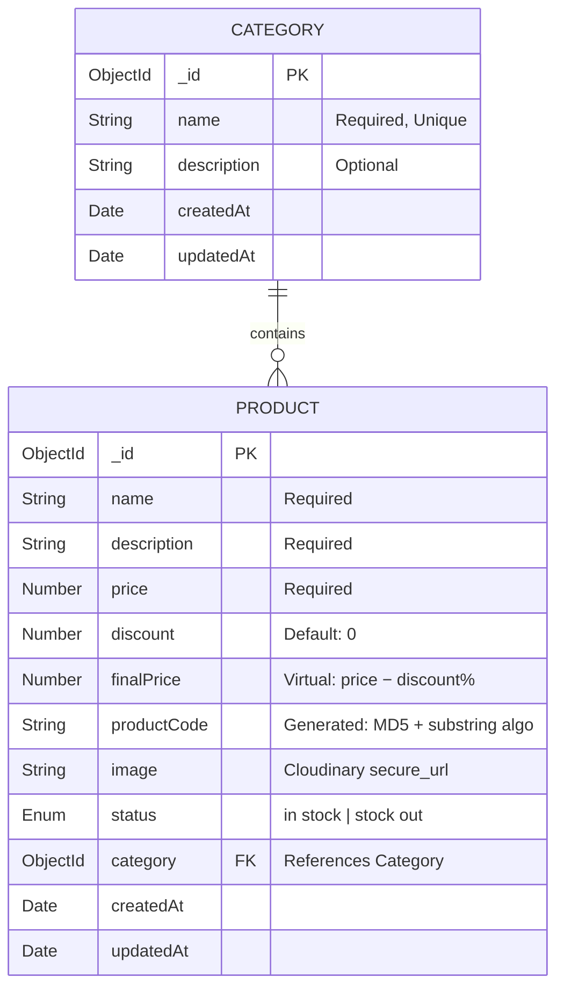

<p align="center">
  <h1 align="center">6SenseHQ — Backend Challenge</h1>
  <p align="center">
    A production-grade REST API for managing <strong>Products</strong> and <strong>Categories</strong>, built with TypeScript, Express 5, and MongoDB.
    <br />
    Featuring algorithmic product code generation, dynamic pricing, Cloudinary CDN integration, and comprehensive Swagger documentation.
  </p>
</p>

<p align="center">
  
  
  
  
  
  
  
</p>

---

## Table of Contents

1. [Project Overview](#project-overview)
2. [Tech Stack](#tech-stack)
3. [Core Features & Business Logic](#core-features--business-logic)
4. [Installation & Setup](#installation--setup)
5. [API Documentation](#api-documentation)
6. [API Endpoints](#api-endpoints)
7. [Testing Strategy](#testing-strategy)
8. [Database Design](#database-design)
9. [Project Structure](#project-structure)
10. [Error Handling](#error-handling)

---

## Project Overview

This project is a backend service built for the **6SenseHQ Backend Developer Challenge**. It implements a complete **Product & Category management system** with an emphasis on correctness, scalability, and professional engineering practices.

**What makes it production-ready:**

- **Algorithmic uniqueness** — Every product receives a deterministic, collision-resistant code generated from its name using MD5 hashing + alphabetical substring analysis.
- **Dynamic pricing** — `finalPrice` is computed server-side as a Mongoose virtual, so it's always accurate and never stored stale.
- **Cloud-native media** — Product images are uploaded to Cloudinary via `multipart/form-data` and atomically cleaned up from the CDN upon product deletion.
- **Strict validation** — All payloads pass through Zod schemas before reaching any business logic.
- **Hardened security** — Helmet, HPP, CORS, rate limiting, and MongoDB sanitization are applied globally.

---

## Tech Stack

| Layer | Technology | Purpose |
|---|---|---|
| **Language** | TypeScript 5.9 | End-to-end type safety |
| **Runtime** | Node.js ≥ 18 | Server-side JavaScript |
| **Framework** | Express 5.2 | HTTP routing, middleware pipeline |
| **Database** | MongoDB + Mongoose 9 | Document storage, schema virtuals, population |
| **Validation** | Zod 4 | Request body / query / params schema validation |
| **File Upload** | Multer + Cloudinary SDK | `multipart/form-data` → CDN streaming |
| **Documentation** | Swagger UI (OpenAPI 3.0) | Auto-generated, interactive API docs |
| **Security** | Helmet, HPP, CORS, Rate Limiter | Production-hardened HTTP headers & traffic control |
| **Observability** | Pino Logger + Prometheus | Structured JSON logging, `/metrics` endpoint |
| **Testing** | Vitest + Supertest | Unit tests and containerized integration tests |

---

## Core Features & Business Logic

### 1. Algorithmic Product Code Generation

Every product is assigned a **unique, deterministic code** derived from its name at creation time. This is not a random UUID — it's an algorithmic fingerprint that can be reproduced from the name alone.

**5-step algorithm:**

```
Input: "Wireless Headphones"

Step 1 → Sanitize:    "wirelessheadphones"  (lowercase, no spaces)
Step 2 → MD5 Prefix:  crypto.md5("Wireless Headphones").hex[0..6] → "a7f3b21"
Step 3 → Extract all strictly increasing alphabetical substrings
Step 4 → Select the longest substring(s) and concatenate
Step 5 → Format: <hash>-<startIndex><substring><endIndex>

Output: "a7f3b21-3elssx14"
```

> **Implementation:** [`product.utils.ts`](src/modules/product/product.utils.ts) — The `generateProductCode()` function handles all five steps. It uses Node.js `crypto` for the MD5 prefix and a custom string analysis algorithm for the suffix.

### 2. Dynamic Pricing via Mongoose Virtuals

The `finalPrice` field is **never stored in the database**. It is recomputed on every read as a Mongoose virtual, ensuring pricing is always consistent with the current discount:

```typescript
// product.model.ts
productSchema.virtual('finalPrice').get(function () {
    const discountAmount = this.price * (this.discount / 100);
    return Number((this.price - discountAmount).toFixed(2));
});
```

| Field | Type | Description |
|---|---|---|
| `price` | `Number` | The original listing price (stored) |
| `discount` | `Number` | Percentage discount, 0–100 (stored, default: 0) |
| `finalPrice` | `Virtual` | `price - (price × discount / 100)` (computed, never stored) |

**Example:** A product with `price: 1000` and `discount: 15` returns `finalPrice: 850.00`.

### 3. Cloudinary CDN Integration

- **Upload flow:** Image buffer from Multer is streamed directly to Cloudinary's upload API. The returned `secure_url` is persisted to MongoDB — no local disk I/O.
- **Deletion cascade:** When a product is deleted, the API extracts the `public_id` from the Cloudinary URL and calls `uploader.destroy()`, preventing orphaned CDN assets.

---

## Installation & Setup

### Prerequisites

- **Node.js** ≥ 18.x
- **MongoDB** — [Atlas](https://cloud.mongodb.com/) (recommended) or local instance
- **Cloudinary** account — [Sign up free](https://cloudinary.com/)

### Steps

```bash
# 1. Clone the repository
git clone https://github.com/Nsarkar-XLR8/6SenseHQ_Backend_API.git
cd 6SenseHQ_Backend_API/TS_Boiler_Plate

# 2. Install dependencies
npm install

# 3. Configure environment variables
cp .env.example .env
# Edit .env with your actual credentials (see below)

# 4. Start the development server
npm run dev
```

The API will be live at: **`http://localhost:5000`**

### Required Environment Variables

```env
# ── Server ─────────────────────────────────────────
NODE_ENV=development
PORT=5000

# ── Database ───────────────────────────────────────
MONGODB_URL=mongodb+srv://<user>:<password>@cluster.mongodb.net/<db_name>

# ── JWT ────────────────────────────────────────────
JWT_SECRET=your_super_secret_jwt_key_min_32_characters
JWT_EXPIRES_IN=7d
JWT_REFRESH_TOKEN_SECRET=your_super_secret_refresh_token_key_min_32_characters
JWT_REFRESH_EXPIRES_IN=30d

# ── Cloudinary ─────────────────────────────────────
CLOUDINARY_ENABLED=true
CLOUDINARY_CLOUD_NAME=your_cloud_name
CLOUDINARY_API_KEY=your_api_key
CLOUDINARY_API_SECRET=your_api_secret
```

> See [`TS_Boiler_Plate/.env.example`](TS_Boiler_Plate/.env.example) for the full list of optional variables (Redis, Kafka, RabbitMQ, OAuth, Stripe).

### Available Scripts

| Command | Description |
|---|---|
| `npm run dev` | Start dev server with hot reload |
| `npm run build` | Compile TypeScript → `dist/` |
| `npm start` | Run compiled production build |
| `npm test` | Run unit + health integration tests |
| `npm run test:integration:containers` | Run Docker-based integration tests |
| `npm run typecheck` | Validate TypeScript without emitting |
| `npm run lint` | Run ESLint across the codebase |
| `npm run check:all` | Full CI suite: typecheck + lint + test + contracts + security |

---

## API Documentation

### 🔵 Swagger UI — Interactive Docs

Full interactive API documentation is auto-generated from JSDoc/Swagger annotations.

> **Locally:** Start the server then open → [`http://localhost:5000/api-docs`](http://localhost:5000/api-docs)
>
> Raw OpenAPI 3.0 spec: [`http://localhost:5000/api-docs.json`](http://localhost:5000/api-docs.json)
>
> ℹ️ Swagger UI is enabled in `development` mode and auto-disabled in `production`.

---

### 🟠 Postman Collection — Pre-tested Requests

A complete Postman collection with **pre-written test scripts** for every route is available publicly:

**👉 [View & Import the Postman Collection](https://documenter.getpostman.com/view/50920410/2sBXqDt3y3)**

The collection includes:
- Pre-configured requests for all Category and Product endpoints
- Automatic test assertions on status codes, response shapes, and business logic
- Environment variables for easy base URL switching

---

## API Endpoints

All endpoints are prefixed with **`/api/v1`**.

### Category Endpoints

| Method | Endpoint | Description |
|---|---|---|
| `POST` | `/category/create-category` | Create a new category |
| `GET` | `/category/get-all-categories` | Get all categories (paginated + searchable) |
| `GET` | `/category/get-single-category/:categoryId` | Get a single category by ID |
| `PATCH` | `/category/update-category/:categoryId` | Update category fields |
| `DELETE` | `/category/delete-category/:categoryId` | Delete a category |

#### Create Category — Request Body

```json
{
  "name": "Electronics",
  "description": "Gadgets, devices, and accessories"
}
```

#### Get All Categories — Query Parameters

| Parameter | Type | Default | Description |
|---|---|---|---|
| `searchTerm` | string | — | Regex search across `name` |
| `page` | number | `1` | Page number |
| `limit` | number | `10` | Items per page |
| `sortBy` | string | `createdAt` | Field to sort by (`name`, `createdAt`) |
| `sortOrder` | string | `desc` | `asc` or `desc` |

---

### Product Endpoints

| Method | Endpoint | Description |
|---|---|---|
| `POST` | `/product/create-product` | Create product (`multipart/form-data`) |
| `GET` | `/product/get-all-products` | List products (filtered + paginated) |
| `GET` | `/product/get-single-product/:productId` | Get single product (category populated) |
| `PATCH` | `/product/update-product/:productId` | Update product (`multipart/form-data`) |
| `DELETE` | `/product/delete-product/:productId` | Delete product + purge Cloudinary asset |

#### Create Product — Form Data Fields

| Field | Type | Required | Description |
|---|---|---|---|
| `name` | string | ✅ | Product name |
| `description` | string | ✅ | Product description |
| `price` | number | ✅ | Original listing price |
| `discount` | number | ❌ | Discount percentage (default: `0`) |
| `image` | file | ✅ | Product image — uploaded to Cloudinary |
| `status` | string | ❌ | `"in stock"` or `"stock out"` (default: `"in stock"`) |
| `category` | string | ✅ | Valid Category `_id` (ObjectId) |

#### Get All Products — Query Parameters

| Parameter | Type | Default | Description |
|---|---|---|---|
| `searchTerm` | string | — | Regex search on `name` |
| `category` | string | — | Filter by Category ObjectId |
| `page` | number | `1` | Page number |
| `limit` | number | `10` | Items per page |
| `sortBy` | string | `createdAt` | `name`, `price`, `discount`, or `createdAt` |
| `sortOrder` | string | `desc` | `asc` or `desc` |

#### Sample Response — Single Product

```json
{
  "success": true,
  "statusCode": 200,
  "message": "Product retrieved successfully",
  "data": {
    "_id": "6632f1a9b4c2e8d1a0f3b456",
    "name": "Wireless Headphones",
    "description": "Premium noise-cancelling headphones",
    "price": 1200,
    "discount": 15,
    "finalPrice": 1020,
    "productCode": "a7f3b21-3elssx14",
    "image": "https://res.cloudinary.com/your-cloud/image/upload/v1/products/abc123.jpg",
    "status": "in stock",
    "category": {
      "_id": "6632e9b7c1d4a8f0b2e1c789",
      "name": "Electronics",
      "description": "Gadgets and devices"
    },
    "createdAt": "2026-04-19T10:00:00.000Z",
    "updatedAt": "2026-04-19T10:00:00.000Z"
  }
}
```

---

## Testing Strategy

Testing is structured in two layers to balance speed and confidence:

### Layer 1 — Postman Collection (Manual API Verification)

**👉 [Open Postman Collection](https://documenter.getpostman.com/view/50920410/2sBXqDt3y3)**

Pre-written test scripts cover every route and assert:

- ✅ Correct HTTP status codes (`201`, `200`, `400`, `404`)
- ✅ Response envelope shape (`success`, `statusCode`, `message`, `data`)
- ✅ Business logic — `productCode` is generated, `finalPrice` matches formula
- ✅ Referential integrity — creating a product with an invalid `category` returns `404`
- ✅ Cascade deletion — product removal triggers Cloudinary CDN cleanup

**Run order:** Create Category → Create Product → Read → Update → Delete

---

### Layer 2 — Automated Tests (Vitest + Supertest)

```bash
# Unit + health integration tests (runs in CI — no Docker required)
npm test

# Containerized integration tests (requires Docker)
npm run test:integration:containers
```

| Suite | File | Coverage |
|---|---|---|
| Health Checks | `tests/integration/health.test.ts` | Server boot, `/health`, `/ready`, `/metrics` endpoints |
| Category Integration | `tests/integration/category.containerized.test.ts` | Full CRUD lifecycle against real MongoDB container |
| Product Integration | `tests/integration/product.containerized.test.ts` | CRUD + Cloudinary mock + referential integrity |
| Product Utils Unit | `tests/unit/utils/productUtils.test.ts` | `generateProductCode()` algorithm correctness |

---

## Database Design

The system uses two MongoDB collections connected by a **one-to-many relationship** — one Category can contain many Products.




**Key design decisions:**

| Decision | Reason |
|---|---|
| `finalPrice` is a Mongoose virtual | Pricing is always live — no risk of stale discount data |
| `productCode` is algorithm-derived | Deterministic & auditable — same name always yields same code prefix |
| `category` uses `ref` + `.populate()` | `GET /product/:id` returns the full category object, not just an ID |
| Product images deleted on cascade | Prevents orphaned CDN assets — `public_id` is extracted from the URL |

---

## Project Structure

```
6SenseHQ_Backend_API/
└── TS_Boiler_Plate/
    ├── src/
    │   ├── config/                  # Env, logger, Swagger config
    │   ├── database/                # MongoDB connection + seeds
    │   ├── errors/                  # AppError class with factory methods
    │   ├── middlewares/             # Auth, validation, rate limiter, multer, error handler
    │   ├── modules/
    │   │   ├── category/            # Category module (MVC)
    │   │   │   ├── category.interface.ts
    │   │   │   ├── category.model.ts
    │   │   │   ├── category.validation.ts
    │   │   │   ├── category.service.ts
    │   │   │   ├── category.controller.ts
    │   │   │   └── category.routes.ts
    │   │   └── product/             # Product module (MVC)
    │   │       ├── product.interface.ts
    │   │       ├── product.model.ts
    │   │       ├── product.validation.ts
    │   │       ├── product.service.ts
    │   │       ├── product.controller.ts
    │   │       ├── product.routes.ts
    │   │       └── product.utils.ts  ← Code generation algorithm
    │   ├── routes/                  # Route aggregator
    │   ├── utils/                   # Pagination, sendResponse, Cloudinary, pick
    │   ├── app.ts                   # Express app factory
    │   └── server.ts                # Entry point: connect DB → start server
    ├── tests/
    │   ├── integration/             # Supertest API tests
    │   ├── unit/                    # Isolated unit tests
    │   └── helpers/                 # Testcontainers setup
    ├── assets/
    │   └── database-schema.png      # ER diagram
    ├── .env.example                 # Environment variable template
    ├── vitest.config.ts             # Standard test config
    ├── vitest.containerized.config.ts  # Docker integration test config
    └── package.json
```

Each module follows the strict pattern:
**Interface → Model → Validation → Service → Controller → Route**

---

## Error Handling

All errors are centralized through a `globalErrorHandler` middleware. The custom `AppError` class provides factory methods:

```typescript
AppError.badRequest("Invalid input", [{ path: "image", message: "Image is required" }]);
AppError.notFound("Product not found.");
AppError.of(502, "Cloudinary upload failed");
```

Every error response is a consistent envelope:

```json
{
  "success": false,
  "statusCode": 404,
  "message": "Product not found.",
  "errorMessages": [
    { "path": "", "message": "Product not found." }
  ]
}
```

Zod validation errors are automatically mapped to this format with field-level path detail.

---

<p align="center">
  Built with intent for the <strong>6SenseHQ Backend Developer Challenge</strong>
  <br/>
  <a href="https://documenter.getpostman.com/view/50920410/2sBXqDt3y3">📮 Postman Collection</a> &nbsp;|&nbsp;
  <a href="http://localhost:5000/api-docs">📄 Swagger Docs (local)</a> &nbsp;|&nbsp;
  <a href="https://github.com/Nsarkar-XLR8/6SenseHQ_Backend_API">💻 GitHub Repository</a>
</p>
